# Game Store

## Vision
Application for selection and order games. Implemented basket, comments for games, 
registration and authorization, order games, editing your profile including adding 
a photo. Role types: guest, user, manager and admin.

#### As a guest:
* View the catalog of available games
* Registration
* See the full description of each game
* Search games by name and filter by genre

#### As a user:
* Login/Logout
* Edit your profile
* Add/delete/edit cart entries
* Add/delete/edit comments
* Reply to comments from other users
* Place an order from the shopping cart

#### As a manager:
* Login/Logout
* Edit your profile
* Delete user comments
* Add/remove/edit games
* Change game status to hidden

#### As a admin:
* Grant permissions to users
* Same permissions as a manager.

## Games
### View the catalog of available games
The mode is intended for viewing the list of games if the list is not empty.

***Main scenario:***
* Guest/User/Manager/Admin select item “Games” or click on logo;
* Application displays list of games.

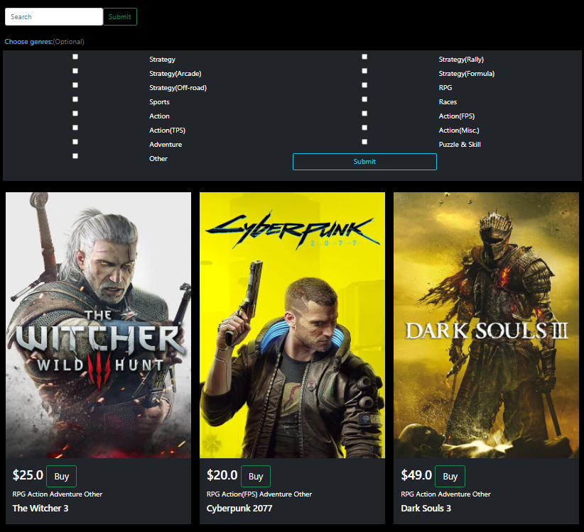

Pic. 1.1 View the games list.

### Search game by name

***Main scenario:***
* At the top of the main page, in the search bar, enter the name of the game or part of it.
* As a result will be games with corresponding names.

### Sorting by genres

***Main scenario:***
* At the top of the main page, in the list with genres, choose genres that you need.
* Press "Submit"
* As a result will be games with corresponding genres.

### Full description of each game

***Main scenario:***
* Click on name of the game
* Application displays details about the game.

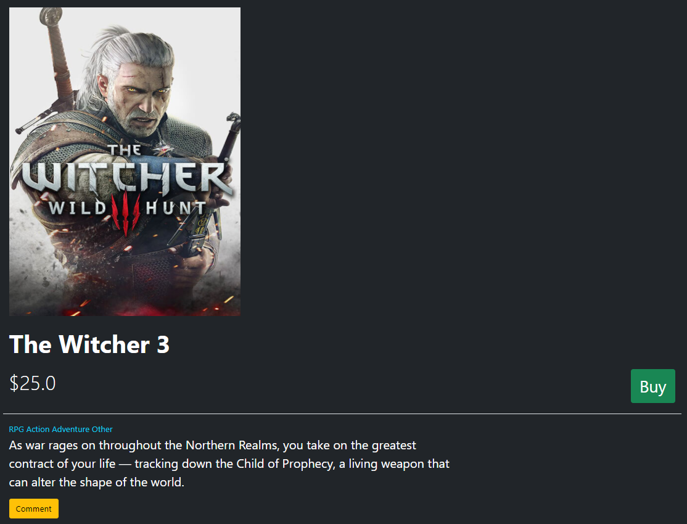

Pic. 1.2 View details about the game.

### Delete game
Only for manager or admin.

***Main scenario:***
* Click on "Delete" button on page with details about the game.
* Application delete game and you redirect to home page.

### Edit game
Only for manager or admin.

***Main scenario:***
* Click on "Edit" button on page with details about the game.
* Application redirect you to edit page.
* You are making changes.
* Click on the "Submit" button.
* Application redirect you to page with game details.

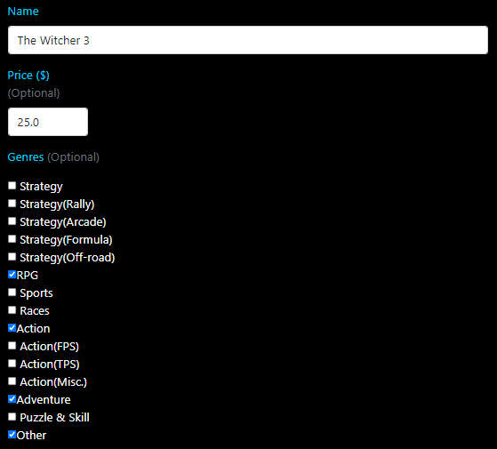

Pic. 1.3 Edit game, part 1.

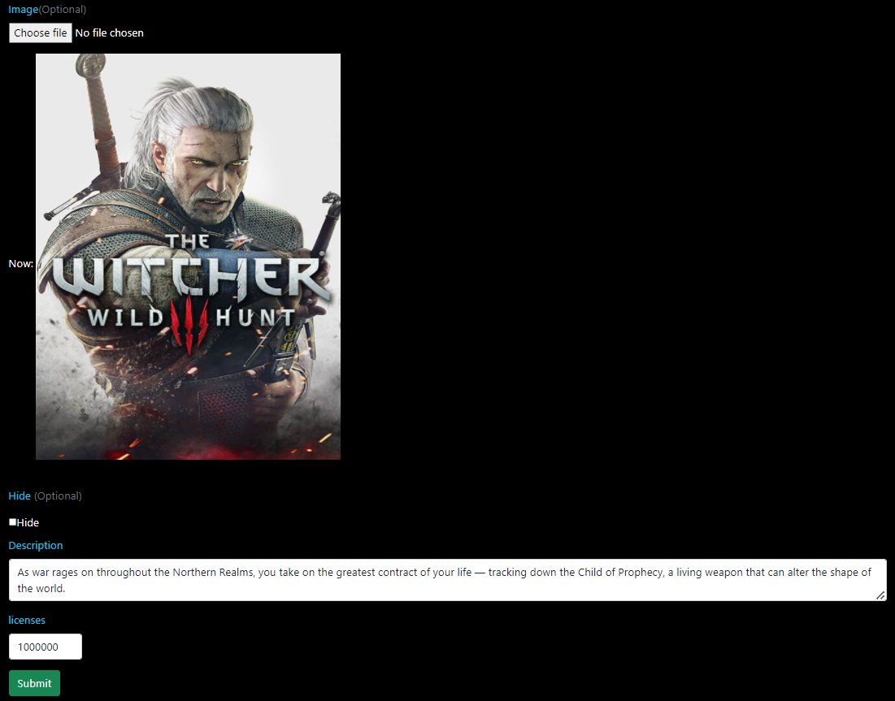

Pic. 1.4 Edit game, part 2.

### Add game
Only for manager or admin.

***Main scenario:***
* Click on "Add game" button on main page.
* Application redirect you to add page.
* Enter data.
* Press the submit button.
* If form was cleared, game added successfully.

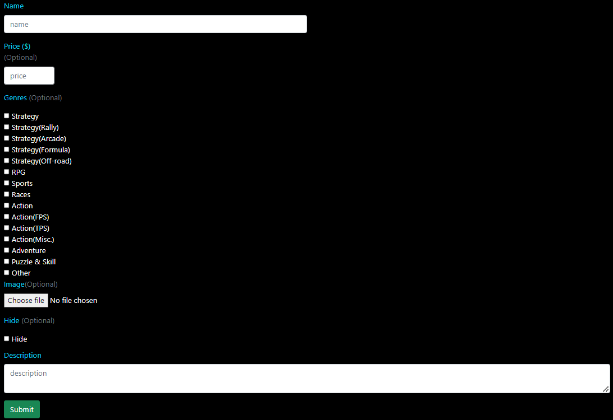

Pic. 1.5 Form for add game.

## Registration and Authentication

### Registration

***Main scenario:***
* Click on "Sign in" button on main page.
* Click on "Register" button at the bottom of the page.
* Fill the form.
* Press the submit button.
* If form was cleared, game added successfully.

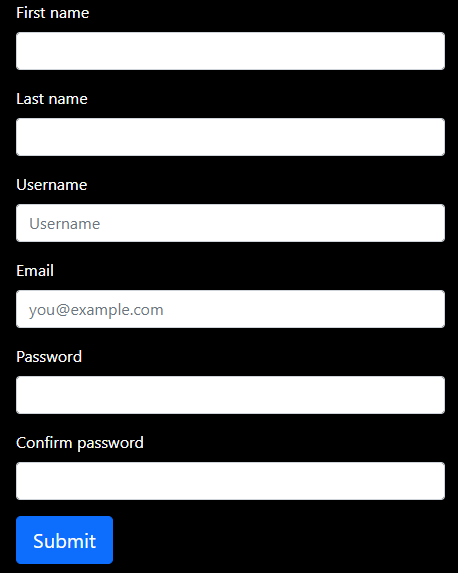

Pic. 1.6 Form for registration.

### Authentication

***Main scenario:***
* Click on "Sign in" button on main page.
* Enter your email and password.
* Click "remember me" if you want.(Within 7 days you do not need to re-login.)
* Click "Sign in" bottom.
* If success, you redirect to main page and 
in the upper right corner there will be your first / last name, photo(if you added) and a cart icon.

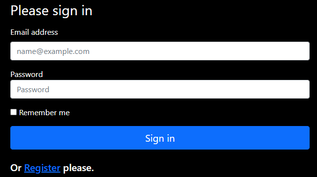

Pic. 1.7 Form for sign in.

### View information about your account.

***Main scenario:***
* Click on your name on the main page.
* Application redirect you to page with information about your account.

Pic. 1.8 Information about your account.

### Edit user

***Main scenario:***
* Click on "Edit user information" button on page with info about user.
* Application redirect you to page for edit users info.
* Make changes.
* Click on "Submit" button.
* Application redirect you to page with user info.

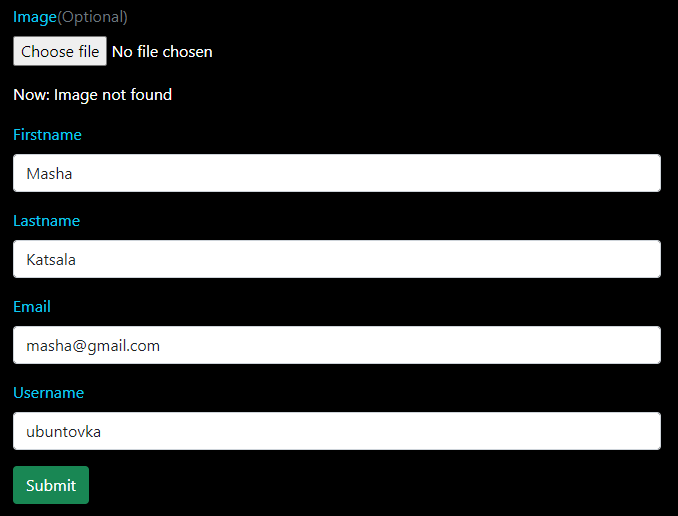

Pic. 1.9 Form for edit user information.

### Exit from account

***Main scenario:***
* On the right side at the top of each page there is a button "Exit", press it.
* You have logged out of your account.

## Game Comment

### View comments
Only for registered users.

***Main scenario:***
* At the bottom of the page with information about the game, you can see the comments for this game if they exist.
* You can click on "reply" for reply on comment.

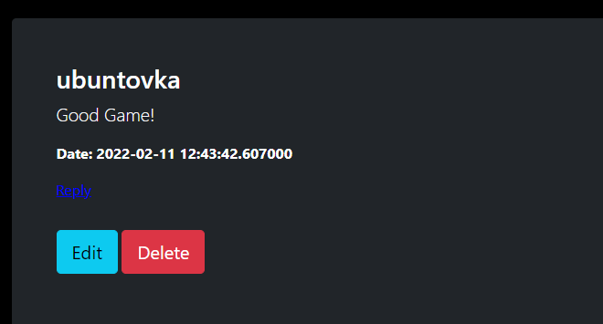

Pic. 1.10 Comment.

### Add comment
Only for registered users.

***Main scenario:***
* Click "Comment" yellow bottom.
* Enter your comment.
* Click on "Save" if you want save it.
* Click on "Cancel" if you want cancel it.
* Your comment appear below the game.

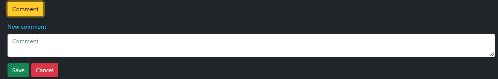

Pic. 1.11 A field for entering a comment.

### Edit comment
Only for registered users.

***Main scenario:***
* Click the "Edit" button below your comment.
* Application redirect you to page for edit comments.
* Make changes to your comment.
* Click "Submit"
* Application redirect you to page with games info.

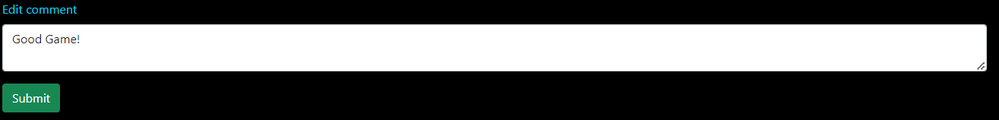

Pic. 1.12 A field for edit a comment.

### Delete comment
Only for registered users.

***Main scenario:***
* Click the "Delete" button below your comment.
* Application redirect you to page with text "The comment was deleted by author." 
(This page is under construction, that's why)

### Reply on comment
Only for registered users.

***Main scenario:***
* Click the "Reply" button below a comment.
* Application redirect you to page for enter comment.
* Enter your comment.
* Click on "Save" if you want save it.
* Click on "Cancel" if you want cancel it.
* After "Cancel" the field will be cleared.
* After "Submit" you redirect to page with game info.
* Your comment is below the comment you replied to.

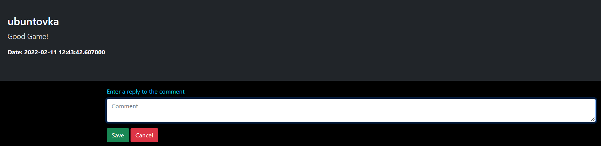

Pic. 1.13 A field for add a comment.

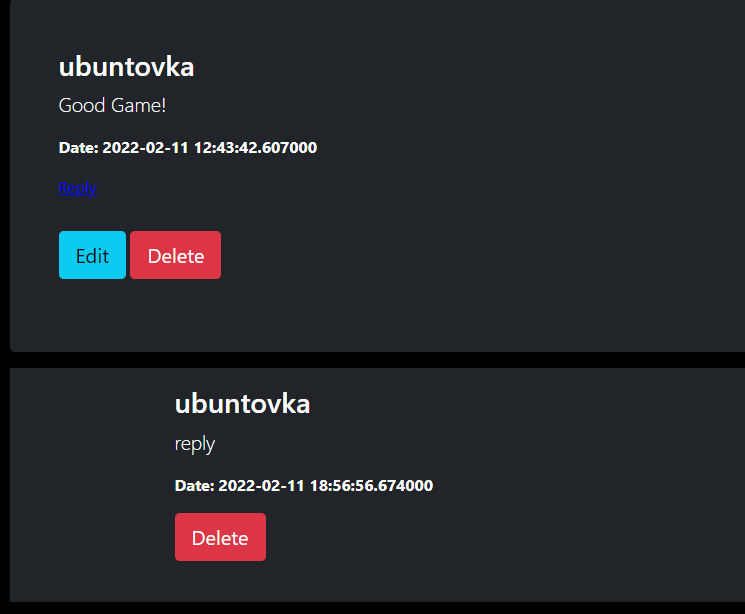

Pic. 1.14 Your comment.

## Cart

### Add to cart
Only for registered users.

***Main scenario:***
* Click on "Buy" button on the main page or on the page with game info.
* You find a " 'Name of game' was added in your cart. "

***Second scenario:***
* Click on the cart img.
* You redirect to cart page.
* You may click on "+" and increase count of each game.

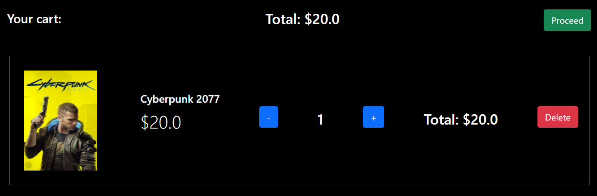

Pic. 1.15 Your cart.

### Edit cart
Only for registered users.

***If you want to reduce the amount of game:***
* Click on the cart img.
* You redirect to cart page.
* Click on "-" and reduce count of each game.

***If you want to increase the amount of game:***
* Click on the cart img.
* You redirect to cart page.
* Click on "+" and increase count of each game.

### Delete from cart
Only for registered users.

***Main scenario:***
* Click on the cart img.
* You redirect to cart page.
* Click on "Delete" for delete the game from cart.

## Order

### Add order
Only for registered users.

***Main scenario:***
* Click on the cart img.
* You redirect to cart page.
* Check whether the quantity of goods is correct and pay attention to the price.
* Click on "Proceed"
* You redirect to page for order.
* Enter the required data in the form.
* Click on "Order"

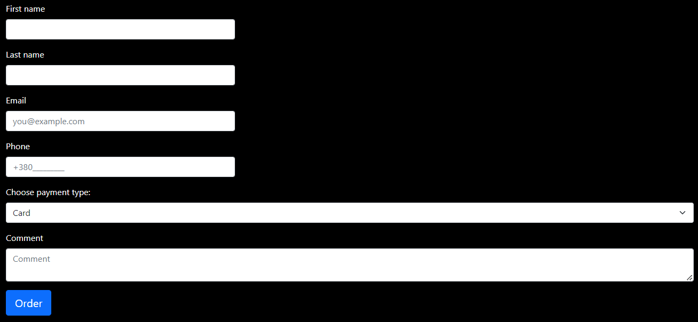

Pic. 1.16 Form for add order.